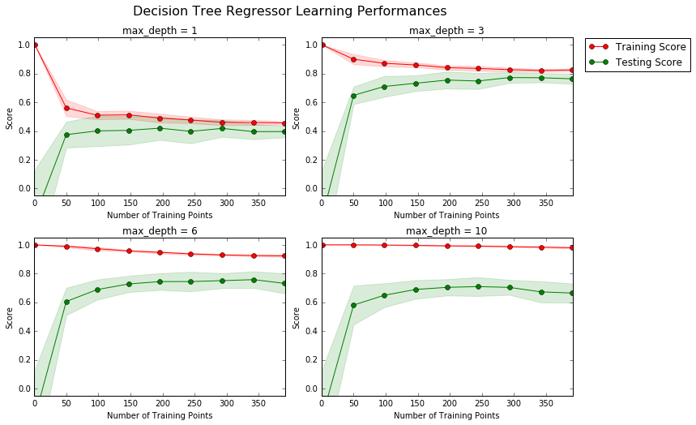
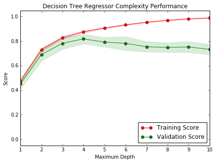

# Machine Learning project : Boston Housing Prices 

This project applies  basic machine learning concepts on data collected for housing prices in the Boston, Massachusetts area to predict the selling price of a new home.

**Software and Libraries**

This project uses the following software and Python libraries:

- Python 2.7
- NumPy
- pandas
- matplotlib
- scikit-learn

**Introduction**

The dataset for this project originates from the [UCI Machine Learning Repository](https://archive.ics.uci.edu/ml/datasets/Housing). The Boston housing data was collected in 1978 and each of the 506 entries represent aggregated data about 14 features for homes from various suburbs in Boston, Massachusetts. 
For the purposes of this project, the following preoprocessing steps have been made to the dataset:
- 16 data points have an `'MDEV'` value of 50.0. These data points likely contain **missing or censored values** and have been removed.
- 1 data point has an `'RM'` value of 8.78. This data point can be considered an **outlier** and has been removed.
- The features `'RM'`, `'LSTAT'`, `'PTRATIO'`, and `'MDEV'` are essential. The remaining **non-relevant features** have been excluded.
- The feature `'MDEV'` has been **multiplicatively scaled** to account for 35 years of market inflation.

**Statistics for Boston housing dataset:**

    Minimum price: $105,000.00
    Maximum price: $1,024,800.00
    Mean price: $454,342.94
    Median price $438,900.00
    Standard deviation of prices: $165,171.13
    
**Feature Observation:**

The following behavioral trends are expected from the data:
- **RM** : The prices increase with increase in the average number of rooms among homes in the neighborhood. Larger homes have higher prices.
- **LSTAT** : Lower the LSTAT, higher should be the prices in the neighborhood ie. a lower LTSAT indicates people with higher incomes in the neighborhood as compared to others. More affluent families tend to have more expensive homes.
- **PTRATIO** : Lower the studentt teacher ratio, higher the quality of education and therefore, the neighborhood would be more sought after and have a higher price.

**Defining a performance metric**
```python
from sklearn.metrics import r2_score

def performance_metric(y_true, y_predict):
    """ Calculates and returns the performance score between true and predicted values based on the metric chosen. """
    score = r2_score(y_true, y_predict)
    return score
```
**Learning Curves**
We produced four graphs for a decision tree model with different maximum depths. Each graph visualizes the learning curves of the model for both training and testing as the size of the training set is increased. The shaded reigon of a learning curve denotes the uncertainty of that curve (measured as the standard deviation). The model is scored on both the training and testing sets using R<sup>2</sup>, the coefficient of determination.  

```python
vs.ModelLearning(features, prices)
```


**Learning the data:**
If we consider the graph with max_depth =3, the training curve has a negative slope and as more training points are added, the score of the training curve decreases before stabilising at ~0.8. At the same time, adding more training points increases the score of the testing data which undergoes a sharp positive slope in the initial testing points before stabilising at a value of close to ~0.8. At close to 300 points, the two curves converge before diverging slightly. 

From this, it would be safe to assume that 300 training points represents the optimum training-testing trade off.

**Complexity Curves:**

We considered a graph for a decision tree model that has been trained and validated on the training data using different maximum depths. The graph produces two complexity curves — one for training and one for validation. Similar to the **learning curves**, the shaded regions of both the complexity curves denote the uncertainty in those curves, and the model is scored on both the training and validation sets using the `performance_metric` function.  

```python
vs.ModelComplexity(X_train, y_train)
```


**Bias-Variance Tradeoff:**
- When the model is trained with max depth of 1, the model has high bias because training score and validation score are both low, and the model is consequently underfitting the data. 
- When the model is tested with max depth 10, the model has low bias and high variance. In fact, the training R^2 is close to 1 while the validation R^2 is comparitively lower (closer to ~0.7). This indicates overfitting of data.

**Best Guess Optimal Model:**
A max depth of 4 best generalises the unseen data as validation score for depth ~ 4 is the highest. As the training score increases beyond max_depth 4, the model starts overfitting the data and this is indicated by a decrease in validation R^2. A max_depth of 4 indicates a model which is neither over-simplified nor overtly complex.

**Fitting a model**
```python
from sklearn.metrics import make_scorer
from sklearn.tree import DecisionTreeRegressor 
from sklearn.grid_search import GridSearchCV

def fit_model(X, y):
    """ Performs grid search over the 'max_depth' parameter for a decision tree regressor trained on the input data [X, y]. """
    cv_sets = ShuffleSplit(X.shape[0], n_iter = 10, test_size = 0.20, random_state = 0)
    regressor = DecisionTreeRegressor()
    params = {"max_depth":range(1,10)}
    scoring_fnc = make_scorer(performance_metric)
    grid = GridSearchCV(regressor, params, scoring_fnc, cv=cv_sets)
    grid = grid.fit(X, y)
    return grid.best_estimator_
```
**Selecting an Optimal Model**
```python
reg = fit_model(X_train, y_train)
print "Parameter 'max_depth' is {} for the optimal model.".format(reg.get_params()['max_depth'])
```
 Parameter 'max_depth' is 4 for the optimal model.

**Predict selling prices and validate using nearest neighbours**
```python
from sklearn.neighbors import NearestNeighbors

import warnings
warnings.filterwarnings("ignore")
# Produce a matrix for client data
client_data = [[5, 34, 15], # Client 1
               [4, 55, 22], # Client 2
               [8, 7, 12]]  # Client 3

# Show predictions
for i, price in enumerate(reg.predict(client_data)):
    print "Predicted selling price for Client {}'s home: ${:,.2f}".format(i+1, price)

num_neighbors=5
def nearest_neighbor_price(x):
    def find_nearest_neighbor_indexes(x, X):
        # x is the vector and X is the data set.
        neigh = NearestNeighbors( num_neighbors )
        neigh.fit(X)
        distance, indexes = neigh.kneighbors( x )
        return indexes
    indexes = find_nearest_neighbor_indexes(x, features)
    sum_prices = []
    for i in indexes:
        sum_prices.append(prices[i])
    neighbor_avg = np.mean(sum_prices)
    return neighbor_avg
```
Predicted selling price for Client 1's home: $339,570.00

Predicted selling price for Client 2's home: $212,223.53

Predicted selling price for Client 3's home: $938,053.85

The predicted 5 nearest neighbors price for Client 1's home is: $315,840.00

The predicted 5 nearest neighbors price for Client 2's home is: $280,980.00

The predicted 5 nearest neighbors price for Client 3's home is: $808,920.00

**Sensitivity**
An optimal model is not necessarily a robust model. Sometimes, a model is either too complex or too simple to sufficiently generalize to new data. Sometimes, a model could use a learning algorithm that is not appropriate for the structure of the data given. Other times, the data itself could be too noisy or contain too few samples to allow a model to adequately capture the target variable — i.e., the model is underfitted. 
The `fit_model` function is run ten times with different training and testing sets to see how the prediction for a specific client changes with the data it's trained on.


```python
vs.PredictTrials(features, prices, fit_model, client_data)
```

- Trial 1: $324,240.00
- Trial 2: $324,450.00
- Trial 3: $346,500.00
- Trial 4: $420,622.22
- Trial 5: $302,400.00
- Trial 6: $411,931.58
- Trial 7: $344,750.00
- Trial 8: $407,232.00
- Trial 9: $352,315.38
- Trial 10: $316,890.00
 
**Range in prices: $118,222.22**

**Limitations** The constructed model isn't suitable for the real world setting as it misses out on a lot of important features such as the nature of neighborhood, the age of the house, the crime rate of the neighborhood etc. Real-world would be much more complex as people tend to take into account many other while choosing a home. However, the size of the data would need to be correspondingly larger due to the ```Curse of Dimensionality```.
